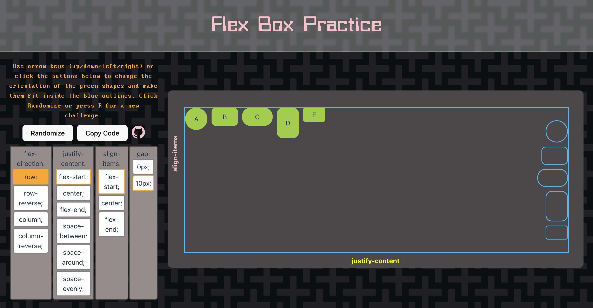

# Flex-Box Interactive Tutorial
This interactive app demonstrates how to use the basic flex-box settings to orient items within a div.

## To add

**What else do I need?**
softcode everything, including array of arrays? Would make it easier to reorder
padding?
flex-wrap? 
other options like baseline, start, end, for objects of diff height and width